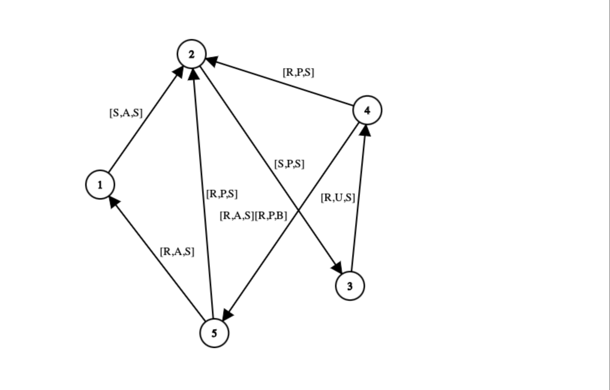
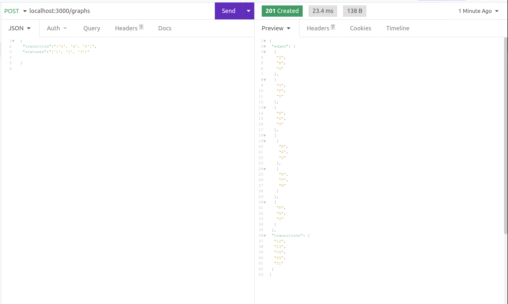
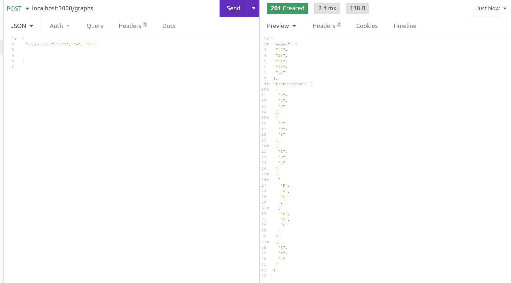

<div id="top"></div>
<!--
*** Thanks for checking out the graphTestProductiveSoftware. If you have a suggestion
*** that would make this better, please fork the repo and create a pull request
*** or simply open an issue with the tag "enhancement".
*** Don't forget to give the project a star!
*** Thanks again! Now go create something AMAZING! :D
-->


<!-- PROJECT SHIELDS -->
<!--
*** I'm using markdown "reference style" links for readability.
*** Reference links are enclosed in brackets [ ] instead of parentheses ( ).
*** See the bottom of this document for the declaration of the reference variables
*** for contributors-url, forks-url, etc. This is an optional, concise syntax you may use.
*** https://www.markdownguide.org/basic-syntax/#reference-style-links
-->
[![Contributors][contributors-shield]][contributors-url]
[![Forks][forks-shield]][forks-url]
[![Stargazers][stars-shield]][stars-url]
[![Issues][issues-shield]][issues-url]
[![MIT License][license-shield]][license-url]
[![LinkedIn][linkedin-shield]][linkedin-url]


## Task 


The system should support the following :
- Given a transition, the system will know which status is the next one
- Given a transition , and bulk of statuses : the system will find the correct path to the next status of the given transition .
  a. For example : given a transition [R,A,S] with array of statuses [ 4 , 5 , 2 ]

## Design of the solution

Case 1:

  ```sh
  exampleInput = {
    "transition":"['S', 'A', 'S']",	     
    "statuses":"['1', '2', '3']"	
  }
  ```
Given a transition and a bulk of statuses the system :
  - The system assigns the current value as the last element of the statuses array.
  - The destination is the first value in the statuses array.
  - Keep track of the visited nodes and push to the visited array whenever we generate the next value
  - If the next value is a single value:
    - The next value of the status is retreived from the adjacency list 
    - The transition string is derived from joining the current and the next
    - Current value is overwritten with next and the cycle continues until the next value is equal to the destination value 
  - If the next value is an array and is not yet visited
    - Run a depth first search recursively and return the transition array of arrays and the visited set. 
    - Return the shortest transition from the step above since the system seeks to find the shortest path to the destination
  - If the next value is visited continue with the loop 


Case 2:

 When given only a transition, the system should return the shortest path from the start of the transition
  ```sh
  exampleInput = {
    "transition":"['S', 'A', 'S']",	     

  }
  ```
 In this case:
  - system returns all possible edges with the transition 
  - Performs all the steps in case one ablove
  - Returns the edge with the shortest path


### Built With

* [Node.js](https://nodejs.org/) v16.2.0 and NPM v8.3.1

<p align="right">(<a href="#top">back to top</a>)</p>

<!-- GETTING STARTED -->
## Getting Started

To run this project ensure you have nodejs installed on your system Find instructions on the [Node.js documentation](https://nodejs.org/)


### Installation


1. Clone the repo
   ```sh
   git clone https://github.com/wamaithanyamu/graphTestProductiveSoftware.git
   ```
   
2. Navigate to the project foldler
   ```shell
   cd graphTestProductiveSoftware
    ```

2. Install NPM packages
   ```sh
   npm install
   ```
3. Run server
   ```sh
   npm run start:dev
   ```

<p align="right">(<a href="#top">back to top</a>)</p>


<!-- USAGE EXAMPLES -->
## Usage

You can test the endpoint using postman as shown below

   

## Big O and space compelxity

The prime numbers algorithm used is the Sieve of Eratosthenes which has a complexity of n*log(log(n))
The palindrome algorithm has a complexity of O(n). However, the algorithm has been  sped up by comparing two halves of a number instead of comparing two strings. 

The space complexity for both algorithms is O(N) since the space occupied depends on the range of numbers we need to compute.


<!-- LICENSE -->
## License

Distributed under the MIT License. See `LICENSE.txt` for more information.


<!-- MARKDOWN LINKS & IMAGES -->
<!-- https://www.markdownguide.org/basic-syntax/#reference-style-links -->
[contributors-shield]: https://img.shields.io/github/contributors/wamaithanyamu/graphTestProductiveSoftware.svg?style=for-the-badge
[contributors-url]: https://github.com/wamaithaNyamu/graphTestProductiveSoftware.git/graphs/contributors
[forks-shield]: https://img.shields.io/github/forks/wamaithanyamu/graphTestProductiveSoftware.svg?style=for-the-badge
[forks-url]: https://github.com/wamaithaNyamu/graphTestProductiveSoftware.git/network/members
[stars-shield]: https://img.shields.io/github/stars/wamaithanyamu/graphTestProductiveSoftware.svg?style=for-the-badge
[stars-url]: https://github.com/wamaithaNyamu/graphTestProductiveSoftware.git/stargazers
[issues-shield]: https://img.shields.io/github/issues/wamaithanyamu/graphTestProductiveSoftware.svg?style=for-the-badge
[issues-url]: https://github.com/wamaithaNyamu/graphTestProductiveSoftware.git/issues
[license-shield]: https://img.shields.io/github/license/wamaithanyamu/graphTestProductiveSoftware.svg?style=for-the-badge
[license-url]: https://github.com/wamaithaNyamu/graphTestProductiveSoftware.git/blob/master/LICENSE.txt
[linkedin-shield]: https://img.shields.io/badge/-LinkedIn-black.svg?style=for-the-badge&logo=linkedin&colorB=555
[linkedin-url]: https://linkedin.com/in/wamaithanyamu
